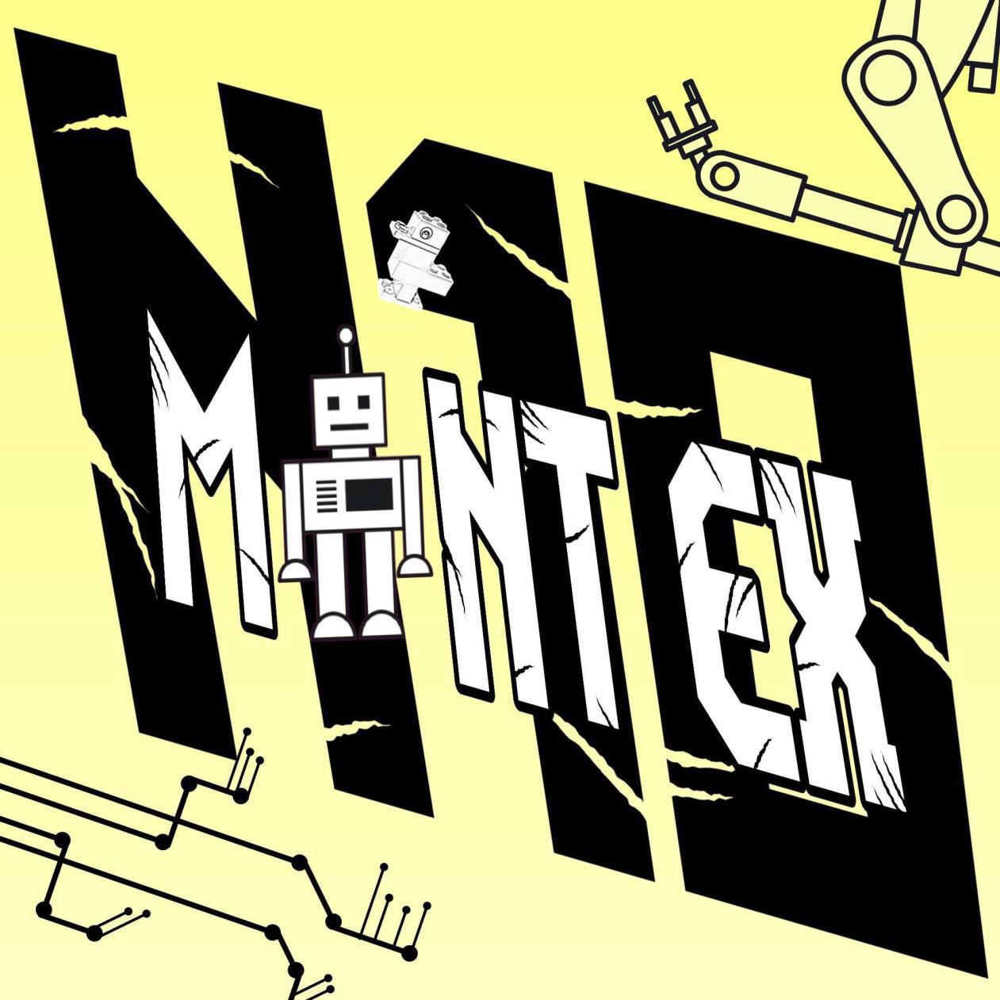

---
# Welcome to the Github account of the robotics team from the Willibald Gluck Gymnasium Neumarkt (Germany).
--- 

Welcome to the GitHub account of **WGG Robotics**, the student robotics team of **Willibald-Gluck-Gymnasium Neumarkt (Germany)**.

We design, build and program our own mobile robots and compete in the **RoboCup Rescue / Rapidly Manufactured Robot Challenge (RMRC)** and other robotics events.

For full documentation, please visit our  **[WGG Robotics Documentation Wiki](https://github.com/wggRobotic/team-docs/wiki).**

## Who we are

- **Team name:** WGG Robotics  
- **School:** Willibald-Gluck-Gymnasium Neumarkt, Bavaria, Germany  
- **Focus:** Rescue robotics, autonomous navigation, rovers, quadrupeds & crawlers  
- **Members:** motivated students from different grades  
- **Mentors:** teachers and external partners supporting hardware, software & project work

We mainly work in our school’s **Makerspace**, using 3D printers, electronics and CAD/simulation tools to prototype and improve our robots.
More background: [About WGG Robotics](https://github.com/wggRobotic/team-docs/wiki/About-WGG-Robotics)

# Our Robots

We currently work on several robots and test platforms:

- **[N10 – RMRC Rover](https://github.com/wggRobotic/Team-Docs/wiki/N10-%E2%80%93-RMRC-Rover)**  
  Mars-style rover for the RoboCup RMRC league with rocker-bogie suspension and modular body.

- **[Idefix – Quadruped Robo Dog](https://github.com/wggRobotic/Team-Docs/wiki/Idefix-%E2%80%93-Quadruped-Robo-Dog)**  
  A four-legged robot dog inspired by Spot and SpotMicro, fully redesigned with new servos and mechanics.

- **[“noname” – SLAM Test Platform](https://github.com/wggRobotic/Team-Docs/wiki/SLAM-Test-Platform-%E2%80%93-%22noname%22)**  
  Mobile base for testing sensors like LIDAR, depth cameras and AI vision for autonomous navigation.

- **QUAC - Crawler**

- **Further platforms**  
  We also experiment with additional robots and demo platforms in cooperation with universities and partners. 

# Sponsors & Partners

We are very grateful for the support of our sponsors and partners, who help us build robots and participate in competitions like RoboCup.

A full list of sponsors and partners can be found here:  

