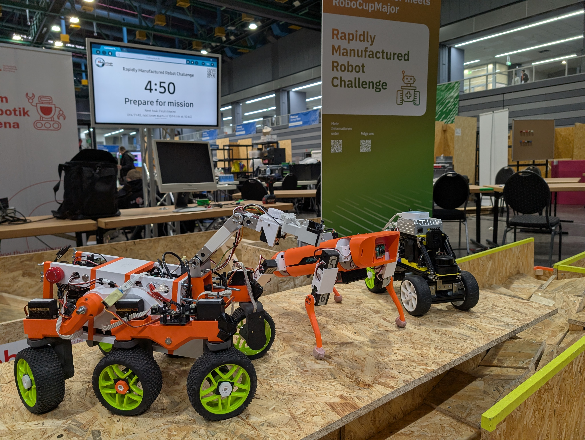
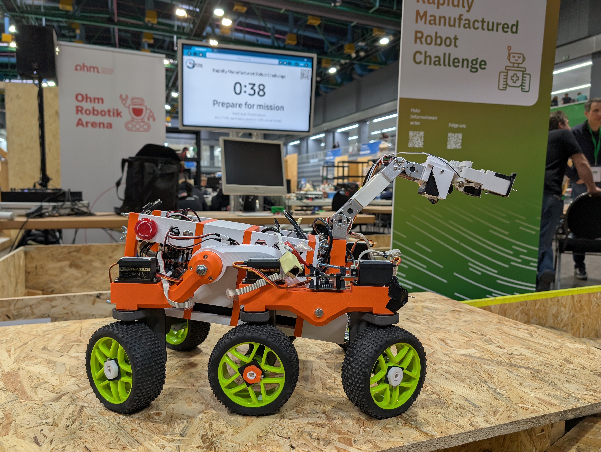

---
# Welcome to the Github account of the robotics team from the Willibald Gluck Gymnasium Neumarkt (Germany).
--- 

# About us

|  |  |
|-----:|-----------|
|Team name     | wggRobotics |
|Name of robots | N10, Idefix and Quac |
|School        | Willibald-Gluck-Gymnasium Neumarkt i. d. OPf.|
|Country        | Germany      |
|Instagram | [wgg_Robotik](https://www.instagram.com/wgg_robotik/) |
|Email contact     | robotik@wgg-neumarkt.de  |

## The Team

**Mentors:**

- **Tobias Wagner**: 
He is the team mentor, and he helps with delivering or ordering the needed parts for our robot. He also gives good advice and tips on how to assemble the robot. Additionally, our mentor also gives us directions when needed.

- **Antonello Pastore**:
- **Raffael Pöggel**:

**Members:**
- **Jonas Nicklas**:
He is our main programmer and does most of the software work. He also helps the other team members by explaining and teaching them how to code.

- **Florian Schäff**:
He focuses on making the 3D design of the chassis of our robot. He also helps Lino with building the robot.

- **Dalea Badri**:
Dalea focuses on taking care of the logistics and organizes the TDP. She is also in charge of our social media account.

- **Fiona Schäff**:
Fiona’s emphasis is on the logistics as well and she handles the TDP together with Dalea, too. If help is needed with the hardware, she lends a hand. She overlookes the whole team.

- **Lino Odenbach**:
Lino’s job is to work on the hardware with Florian Schäff and constructing the robot.

- **Christopher Zech**:
Since he is quite talented and interested in math and programming, he focuses on all the informatics and mathematical aspects as well as programming and the software. He works closely together with Jonas.

(At the Robocup German Open 2025. The robots from left to right are N10, Idefix and our former SLAM-Teststation noname)

## Our School

[Willibald-Gluck-Gymnasium Neumarkt](https://www.wgg-neumarkt.de/)

Woffenbacher Straße 33

92318 Neumarkt 

Bavaria Germany

# Our Robots

#### Everything we work on is available to the public

As a team, we want to be as transparent as possible, so we have decided to make all our components and programmes available as open source. All important information and notes on hardware and software are stored on this Github. 

## N10 - Our rover

___

**For more Information** click here [N10](https://github.com/wggRobotic/N10-profile)
___

N10 is a rover like robot based on a rocker bogie design. The 6 Wheels can turn perpendicular to the ground. The 3-segment robotic arm lays ontop on the rover in its resting position. There, the camera mounted to its gripper can function as a rear camera while driving. The main / front camera is fixed to the first segment.

N10 was our robot in the RoboCup World Championship 2024 in Eindhoven in the RMRC league (Rapidly Manufactured Robot Challenge). This was the first real competition for our newly founded team.

The first version was designed and built in under two months, which led to several challenges along the way and multiple problems in the actual competition. Our previous TDM (Team Description Material) for Eindhoven and the original design are available via the following links:

+ [TDM](https://github.com/wggRobotic/N10-Robot)
+ [Hardware - Robot Design and Components](https://github.com/wggRobotic/CAD-Files-and-Components-N10)

The lessons we learned in Eindhoven were incorporated into our new rover design. We developed a completely new modular main body. While the rocker-bogie suspension remains largely the same, the adjustments to the models and a different 3D-printing method have significantly improved the durability of the parts. Additionally, both the robotic arm and gripper feature a new design.

All components, a list of the parts etc. can be found here: [N10_v.4.0](https://github.com/wggRobotic/CAD-Files-N10_version_4_0)

Software is here:
+ [Software - GUI](https://github.com/wggRobotic/guiniverse)
+ [Software - Servocontroller](https://github.com/wggRobotic/n10_servocontroller)
+ [Software - Motorcontroller](https://github.com/wggRobotic/edu_drive_ros2_mod)
+ [Software - CamStreams](https://github.com/wggRobotic/GStreamerCamStreams)

## Idefix - Our robodog

___

**For more Information** click here [Idefix](https://github.com/wggRobotic/Idefix-profile)
___

Together with Antonello and Raffael, the wggRobotics team had long wanted to build a robotic dog. This year (2024/2025), we finally made it happen! 

Our insperiation came from [Spot](https://bostondynamics.com/products/spot/) by Boston Dynamics and the open-source project [SpotMicro](https://spotmicroai.readthedocs.io/en/latest/).  After initial tests during Consumenta 2024 in Nuremberg, we decided to redesign the dog and use different servo motors.

And now, here is our Idefix!

All components, a list of the parts etc. can be found here: [Hardware](https://github.com/wggRobotic/CAD-Files-Idefix)

Software here:
[RoboDog](https://github.com/wggRobotic/Robodog)

https://github.com/wggRobotic/.github/blob/main/assets/idefix_move.mp4

## Quac - Our autonomous Crawler

___

**For more Information** click here [Quac](https://github.com/wggRobotic/Quac-profile)
___

## NoName - Our SLAM-Teststation

Our test robot, "noname," serves as a platform for evaluating various additional modules, including LIDAR, AI cameras, and depth perception sensors. The ultimate goal of this project is to develop an autonomous navigation system capable of real-time environmental mapping and decision-making.

### Core Components

To achieve these objectives, "noname" is equipped with state-of-the-art hardware:

- OAK-1-Lite W Camera – An AI-powered vision system for object detection and recognition.

- Intel RealSense D435 – A depth camera providing precise 3D perception.

- Slamtec RPLIDAR C1 – A high-precision LIDAR sensor for mapping and obstacle detection.

- Siemens IPC127E – A robust industrial PC handling data processing and computational tasks.

### Project Goals

The primary focus of "noname" is to test and integrate these technologies for efficient autonomous navigation. By leveraging sensor fusion and advanced algorithms, the robot will be able to generate accurate maps of its environment and navigate without human intervention.

With further development, "noname" will contribute to research in autonomous robotics and intelligent mobility solutions.

## Some impressions of this year:

https://raw.githubusercontent.com/wggRobotic/.github/main/assets/idefix_imp0.mp4

https://github.com/wggRobotic/.github/blob/main/assets/idefix_imp0.mp4

https://github.com/wggRobotic/.github/blob/main/assets/idefix_imp1.mp4

https://github.com/wggRobotic/.github/blob/main/assets/n10_imp0.mp4

https://github.com/wggRobotic/.github/blob/main/assets/n10_imp1.mp4

https://github.com/wggRobotic/.github/blob/main/assets/n10_imp2.mp4

https://github.com/wggRobotic/.github/blob/main/assets/n10_imp3.mp4

https://github.com/wggRobotic/.github/blob/main/assets/n10_imp4.mp4

## Some impressions from last year:
**N-10 is alive**

https://github.com/wggRobotic/.github/blob/main/assets/n10_old_imp0.mp4

https://github.com/wggRobotic/.github/blob/main/assets/n10_old_imp1.mp4

**The arm is moving**

https://github.com/wggRobotic/.github/blob/main/assets/n10_old_imp2.qt

